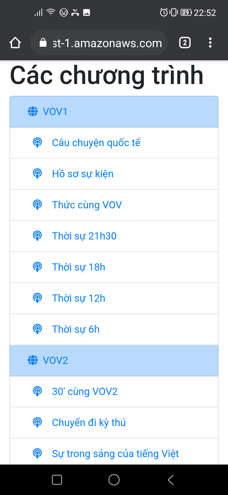
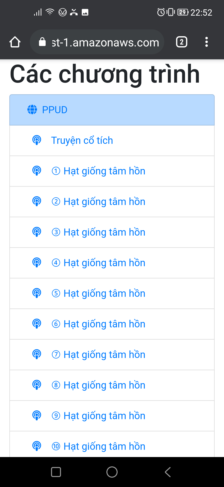
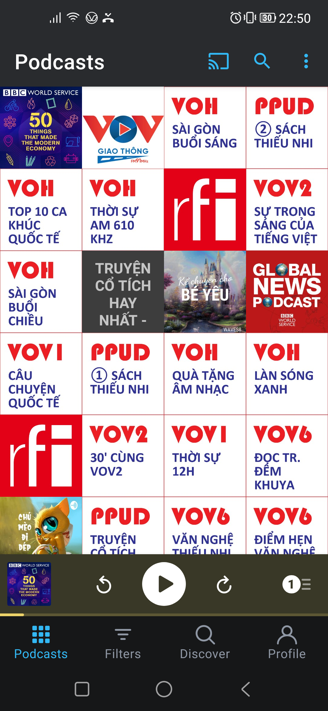
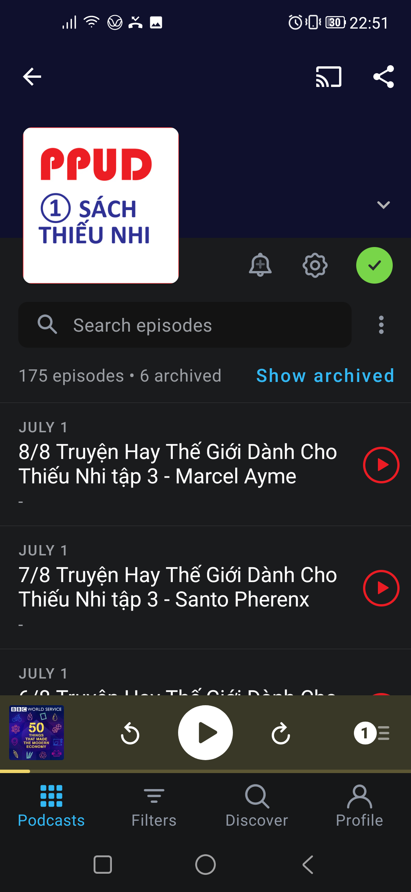
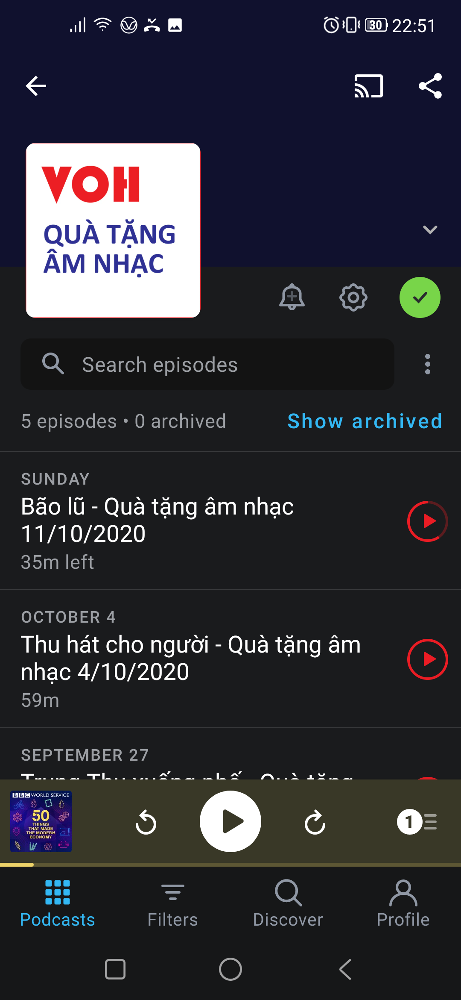

# Radio2Podcasts
Đọc thông tin từ các trang web có audio và chuyển thành các podcast để nghe trên điện thoại dễ dàng.

## Intro
Ở Việt Nam, rất ít trang web của các đài phát thanh có cung cấp podcast để đọc giả nghe lại. Dự án này thực hiện việc
1. Chạy chương trình Python (triển khai trên Heroku) định kỳ hàng giờ
2. Tìm ra các audio mới trên các website
3. Tạo ra file XML có format của podcast
4. Tạo ra file HTML của tất cả các podcast vừa tạo ra
5. Lưu các file XML và HTML lên một trang web (hiện dùng Amazon S3)

Từ đó người dùng mở file HTML là có thể đăng ký nghe podcast dùng Apple Podcast hay Google Podcast trên điện thoại (hay thậm chí trên xe oto kết nối CarPlay/Google Android)

Các trang web hiện nay đã hỗ trợ:
- VOV1 http://vov1.vn/
- VOV2 http://vov2.vov.vn/
- VOV6 http://vov6.vov.vn/
- VOH https://radio.voh.com.vn/
- Phật pháp ứng dụng https://phatphapungdung.com/sach-noi/ (rất nhiều sách nói)

## Hình ảnh sử dụng podcast được tạo ra

#### Danh sách podcast

 

#### Giao diện nghe podcast

 

 

## Dành cho lập trình viên
### Deploy on Heroku
git push heroku main

## Update runtime for Python on Heroku
Edit runtime.txt with respective Python version

### Create new environment
python -m venv c:\path\to\myenv

### Activate
c:\path\to\myenv\Scripts\activate.bat

### Create list of packages
pip freeze > requirements.txt

### Install list of packages
pip install -r requirements.txt

